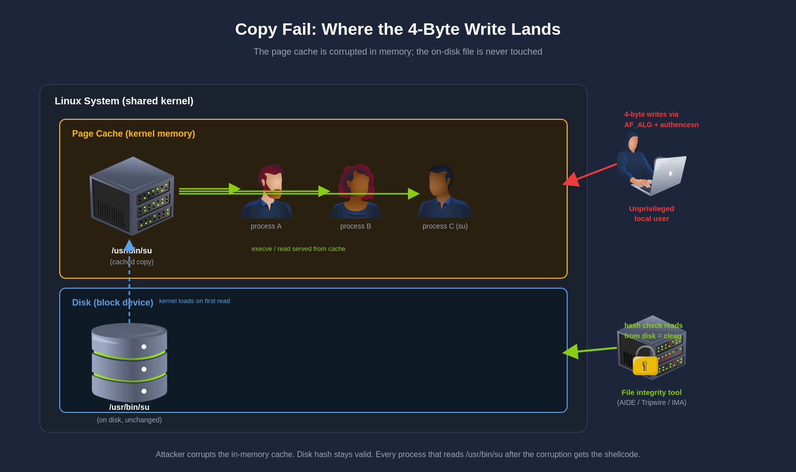

# CVE-2026-31431

### Tóm tắt

**CVE-2026-31431**, còn gọi là **Copy Fail**, là một lỗ hổng leo thang đặc quyền cục bộ nghiêm trọng trong subsystem mật mã của Linux kernel. Lỗ hổng cho phép người dùng không đặc quyền ghi **4 byte có kiểm soát** vào **page cache** của một tệp bất kỳ, kể cả các binary có quyền `setuid-root`.

Điểm nguy hiểm nhất nằm ở chỗ nội dung trên đĩa không thay đổi. Phần bị sửa là bản sao trong bộ nhớ mà kernel thực sự dùng để thực thi tệp. Điều này khiến nhiều cơ chế kiểm tra tính toàn vẹn dựa trên hash của file trên đĩa không phát hiện được bất thường.

#### Điểm chính

* Không cần `race condition`.
* Không cần sửa trực tiếp file trên đĩa.
* Có thể chèn payload từng khối **4 byte** vào binary đặc quyền trong bộ nhớ.

#### Phần mềm bị ảnh hưởng

**Linux kernel:** Các nhánh kernel kế thừa tối ưu hóa AEAD in-place được đưa vào từ năm 2017, xấp xỉ bắt đầu quanh **4.14**.

**Bản phân phối:** Ảnh hưởng trải rộng trên nhiều hệ thống Linux phổ biến, gồm **Ubuntu**, **Amazon Linux**, **RHEL**, **Debian**, **SUSE** và **AlmaLinux**.

#### Điều kiện khai thác

* Kẻ tấn công có quyền chạy mã cục bộ với tài khoản không đặc quyền.
* Hệ thống cho phép dùng `AF_ALG` từ userspace.
* Có một binary đặc quyền phù hợp, như `/usr/bin/su`.
* Kernel chưa được vá theo advisory của nhà phân phối.

### Cơ chế của lỗ hổng

Copy Fail không đến từ một bug đơn lẻ. Nó xuất hiện khi bốn thành phần vốn hợp lệ của kernel được ghép lại theo một cách mà thiết kế ban đầu không tính đến.

Các thành phần đó là:

* **Page cache**
* **AF\_ALG**
* **Template `authencesn`**
* **`splice()` cùng tối ưu hóa AEAD in-place**

#### Page cache

Page cache là vùng nhớ kernel dùng để giữ bản sao của dữ liệu vừa được đọc từ đĩa. Khi một tiến trình đọc tệp, kernel thường nạp dữ liệu vào page cache trước. Những lần đọc sau sẽ dùng lại bản trong bộ nhớ này.

Bộ nhớ cache có tính chia sẻ. Mọi tiến trình trên cùng host đều nhìn thấy cùng các page cache cho một tệp nhất định. Điều đó cũng đúng với nhiều container dùng chung kernel.

Thông thường, khi ghi vào tệp, cả nội dung trên đĩa lẫn trong cache đều được cập nhật. Nhưng trong trường hợp này, page cache có thể bị sửa trực tiếp mà không ghi ngược ra đĩa.

Đây là điểm khiến lỗ hổng đặc biệt nguy hiểm. Các công cụ như **AIDE**, **Tripwire** hay **IMA** chủ yếu kiểm tra hash của file trên đĩa. Nếu chỉ bản trong bộ nhớ bị thay đổi, kết quả kiểm tra vẫn có thể báo sạch.

<figure><figcaption><p>Page cache là bản sao trong bộ nhớ, không phải nội dung vật lý trên đĩa. Nếu vùng này bị sửa, kernel sẽ thực thi bản đã bị thay đổi dù file gốc vẫn nguyên vẹn.</p></figcaption></figure>

#### AF\_ALG

**AF\_ALG** là giao diện socket của Linux cho phép userspace sử dụng subsystem mật mã của kernel. Ứng dụng có thể gọi các thao tác mã hóa, giải mã, băm và AEAD qua các syscall socket thông thường như `bind()`, `sendmsg()` và `recvmsg()`.

Điểm quan trọng là khả năng truy cập. Theo mặc định, người dùng không đặc quyền vẫn có thể mở socket `AF_ALG`. Không cần `CAP_SYS_ADMIN` hay capability đặc biệt khác.

Trong thực tế, số ứng dụng hợp lệ dùng `AF_ALG` khá ít. Điều đó làm cho bề mặt tấn công này thường không được chú ý trong quá trình hardening.

#### `authencesn` và primitive ghi 4 byte

`authencesn` là template AEAD dùng cho IPsec với **Extended Sequence Number**. Trong quá trình giải mã, nó sẽ ghi **4 byte** `seqno_lo` vào vị trí `assoclen + cryptlen` của bộ đệm đầu ra.

Chi tiết có thể bị khai thác nằm ở thứ tự xử lý. Thao tác ghi này diễn ra **trước** bước xác minh HMAC tag. Nếu kiểm tra xác thực thất bại, lời gọi sẽ trả lỗi cho userspace. Nhưng bốn byte kia đã được ghi xong.

Không có rollback. Không có bước dọn bộ đệm đầu ra. Vì vậy, chỉ cần điều khiển được:

* giá trị `seqno_lo`
* offset `assoclen + cryptlen`

kẻ tấn công sẽ có một primitive ghi **4 byte có kiểm soát**.

#### `splice()` và tham chiếu đến page cache

`splice()` di chuyển dữ liệu giữa các file descriptor bằng cách truyền **tham chiếu tới page** thay vì sao chép nội dung. Khi `splice()` từ một tệp thường vào socket, kernel có thể chuyển cho socket tham chiếu tới chính các page của page cache.

Đây là cơ chế zero-copy giúp `splice()` nhanh. Nhưng trong bối cảnh này, nó cũng mở đường cho việc đưa page cache của một tệp thật vào pipeline xử lý mật mã của `AF_ALG`.

Nếu tệp nguồn là `/usr/bin/su`, pipeline sẽ giữ tham chiếu tới page cache thật của binary đó, chứ không phải bản sao do người dùng kiểm soát.

#### Tối ưu hóa AEAD in-place năm 2017

Trước năm 2017, `algif_aead` giữ riêng scatterlist nguồn và đích cho thao tác AEAD. Điều đó tách biệt dữ liệu đầu vào khỏi vùng nhận kết quả.

Commit `72548b093ee3` trong kernel **4.14** thêm tối ưu hóa **in-place** bằng cách gộp hai phía lại và đặt `req->src = req->dst`. Với luồng dữ liệu thông thường, tối ưu hóa này vẫn an toàn vì cả hai phía đều trỏ tới bộ nhớ userspace.

Vấn đề xuất hiện khi dữ liệu đầu vào đến từ `splice()`. Lúc này, scatterlist không còn trỏ tới bộ nhớ do người dùng cấp phát. Nó trỏ tới page cache thật của tệp nguồn.

Khi `req->src` và `req->dst` cùng trỏ vào scatterlist đó, thao tác ghi của `authencesn` vào "đầu ra" thực chất trở thành thao tác ghi trực tiếp vào page cache của tệp.

### Khai thác

#### 1. Dựng đường đi dữ liệu vào page cache của binary mục tiêu

Mục tiêu đầu tiên là đưa page cache của một binary đặc quyền vào pipeline `AF_ALG`. Việc này được thực hiện bằng `splice()` từ tệp mục tiêu vào socket.

<figure><figcaption><p>Chuỗi khai thác bắt đầu bằng việc dùng `splice()` để đưa page cache của binary mục tiêu vào luồng xử lý `AF_ALG`.</p></figcaption></figure>

#### 2. Biến page cache thành đích ghi

Tối ưu hóa in-place trong `algif_aead` khiến nguồn và đích cùng trỏ tới một scatterlist. Với luồng dữ liệu đi qua `splice()`, scatterlist đó lại trỏ vào page cache của tệp thật.

<figure><figcaption><p>Tối ưu hóa in-place làm hỏng giả định an toàn ban đầu. Vùng nhớ lẽ ra chỉ được đọc nay cũng trở thành đích ghi.</p></figcaption></figure>

#### 3. Dùng `authencesn` để ghi 4 byte có kiểm soát

`authencesn` ghi `seqno_lo` vào bộ đệm đầu ra trước khi xác minh HMAC tag. Kẻ tấn công chủ động làm cho bước xác minh cuối cùng thất bại, nhưng vẫn giữ lại thao tác ghi đã xảy ra.

<figure><figcaption><p>Dù HMAC thất bại, 4 byte `seqno_lo` vẫn được ghi trước đó. Đây là primitive ghi có kiểm soát của toàn bộ khai thác.</p></figcaption></figure>

#### 4. Lặp lại để chèn payload vào binary đặc quyền

Primitive chỉ ghi được 4 byte mỗi lần. Vì vậy, khai thác sẽ lặp lại thao tác nhiều lần để chèn payload từng khối 4 byte vào biểu diễn trong bộ nhớ của binary `setuid-root`.

<figure><figcaption><p>Payload được tiêm từng khối nhỏ vào binary đặc quyền trong page cache cho đến khi đủ để giành quyền thực thi.</p></figcaption></figure>

#### 5. Kích hoạt binary đã bị sửa trong bộ nhớ

Khi binary mục tiêu được thực thi lại, kernel nạp bản trong page cache đã bị thay đổi. Nội dung trên đĩa vẫn nguyên vẹn, nhưng mã chạy thực tế đã khác.

<figure><figcaption><p>Lần thực thi kế tiếp sẽ dùng bản trong bộ nhớ đã bị chỉnh sửa. Payload vì thế chạy với quyền root mà không cần sửa file vật lý.</p></figcaption></figure>

### Tác động bảo mật

* **Leo thang đặc quyền lên root** từ tài khoản local không đặc quyền.
* **Bypass kiểm tra tính toàn vẹn trên đĩa** vì file vật lý không đổi.
* **Ảnh hưởng chéo môi trường** trên cùng host kernel do page cache là tài nguyên chia sẻ.
* **Khai thác có tính xác định** vì không phụ thuộc vào race condition.

### Phát hiện

Copy Fail có cửa sổ khai thác rất ngắn. File trên đĩa không bị sửa. Page cache cũng đã sạch khi bước dọn dẹp chạy xong. Các kỹ thuật như kiểm tra hash file, kiểm tra chữ ký binary hay giám sát thay đổi filesystem thường không thấy gì.

Tín hiệu còn lại nằm ở **hành vi tiến trình**, không nằm ở trạng thái hệ thống sau đó. Điều cần theo dõi là chuỗi syscall mà phần mềm hợp lệ gần như không bao giờ tạo ra với tần suất như exploit này.

#### `AF_ALG` socket là tín hiệu chính

Exploit phải gọi `socket(AF_ALG, SOCK_SEQPACKET, 0)` lặp lại rất nhiều lần. Mỗi lần ghi được **4 byte**. Muốn chèn khoảng **40 byte shellcode** thì thường cần xấp xỉ **40 lần lặp**.

Chi tiết `SOCK_SEQPACKET` rất quan trọng. `AF_ALG` với `SOCK_DGRAM` vẫn xuất hiện hợp lệ trong các tác vụ hash và symmetric crypto. `SOCK_SEQPACKET` lại chủ yếu phục vụ AEAD nên ít gặp hơn nhiều. Vì vậy, đây là bộ lọc có độ chính xác cao hơn.

Danh sách tiến trình hợp lệ thường mở `AF_ALG` AEAD socket khá ngắn:

* `cryptsetup`, `systemd-cryptsetup`
* `kcapi-enc`, `kcapi-dgst`, `kcapi-mac`, `kcapi-speed`
* `bluez`, `iwd`
* `charon`, `charon-systemd`

Một tiến trình ngoài nhóm này mà mở `AF_ALG` `SOCK_SEQPACKET` đã là bất thường. Một tiến trình ngoài nhóm này mà mở **40 hoặc hơn** socket như vậy trong vài giây là chỉ báo cực mạnh cho Copy Fail hoặc biến thể của nó.

Trong `auditd`, `AF_ALG` dùng domain value `38`, nên có thể theo dõi bằng rule:

```bash
-a always,exit -F arch=b64 -S socket -F a0=38 -k copy_fail_af_alg
-a always,exit -F arch=b64 -S splice -k copy_fail_splice
```

Rule này kích hoạt ngay từ syscall `socket()` đầu tiên, tức là **trước khi page cache bị ghi bẩn**.

#### Các syscall cần tương quan

Không nên nhìn từng syscall riêng lẻ. Giá trị nằm ở tương quan trong cùng một PID và trong cùng một cửa sổ thời gian ngắn.

Các tín hiệu chính gồm:

* `socket(AF_ALG, ...)` từ tiến trình ngoài allowlist — tín hiệu sớm nhất.
* `splice()` từ file descriptor của binary `setuid` sang socket FD — page cache đi vào crypto pipeline.
* `recvmsg()` trên FD `AF_ALG` lặp lại nhiều lần — mỗi lần tương ứng một lần ghi 4 byte.
* `posix_fadvise(..., DONTNEED)` trên binary `setuid` ngay sau đó — dấu hiệu dọn dấu vết bằng cách đẩy page cache ra ngoài.
* `execve()` của `/usr/bin/su` hoặc binary `setuid` khác ngay sau chuỗi trên — giai đoạn kích hoạt payload.

Một chuỗi như sau có độ tin cậy rất cao:

1. Tiến trình lạ mở nhiều `AF_ALG` `SOCK_SEQPACKET` socket.
2. Cùng PID đó gọi `splice()` và `recvmsg()` lặp lại dày đặc.
3. Sau đó xuất hiện `execve()` của binary `setuid`.
4. Cuối cùng là `posix_fadvise(DONTNEED)` trên chính binary đó.

#### Ví dụ rule Falco

Nếu môi trường dùng Falco hoặc eBPF runtime monitoring, có thể mã hóa logic phát hiện theo hướng sau:

```yaml
- macro: expected_af_alg_processes
  condition: >
    proc.name in (kcapi-enc, kcapi-dgst, kcapi-mac, cryptsetup,
                  kcapi-speed, charon, charon-systemd)

- rule: Potential Copy Fail Exploit (AF_ALG Socket Creation)
  desc: >
    Detects AF_ALG socket creation by unexpected processes.
    Primary signal for CVE-2026-31431.
  condition: >
    evt.type = socket and
    evt.arg.domain = AF_ALG and
    evt.res >= 0 and
    not expected_af_alg_processes
  output: >
    Anomalous AF_ALG socket created
    (user=%user.name uid=%user.loginuid command=%proc.cmdline
     pid=%proc.pid container_id=%container.id image=%container.image.repository)
  priority: CRITICAL
  tags: [host, container, exploit, privilege_escalation, cve_2026_31431]
```

Rule này nên được dùng như **điểm khởi đầu**. Giá trị thực tế đến từ bước tương quan tiếp theo giữa alert `AF_ALG`, chuỗi `recvmsg()`, và `execve()` của binary `setuid` trong cùng time window.

#### Thời điểm phát hiện quan trọng hơn forensic

Đây là kiểu lỗ hổng phải phát hiện **khi đang khai thác**. Nếu chỉ điều tra sau khi máy đã yên, khả năng cao sẽ không còn artifact đáng tin cậy:

* File trên đĩa vẫn sạch.
* Page cache đã bị đẩy ra ngoài.
* Không có binary bị sửa để hash lại.

Vì vậy, forensic dựa riêng vào filesystem là chưa đủ. Cần theo dõi syscall, tiến trình và chuỗi hành vi ở thời gian thực.

#### Ánh xạ MITRE ATT\&CK

* **T1068 — Exploitation for Privilege Escalation:** tiến trình lạ mở `AF_ALG` socket và thao túng kernel crypto path.
* **T1611 — Escape to Host:** nếu khai thác chạy trong container, `container_id` trong alert là tín hiệu quan trọng.
* **T1548.001 — Setuid and Setgid:** `execve()` binary `setuid` sau hoạt động `AF_ALG`.
* **T1070 — Indicator Removal on Host:** `posix_fadvise(DONTNEED)` dùng để xóa dấu vết trong page cache.

### Giảm thiểu

Gốc của lỗ hổng nằm trong module kernel `algif_aead`. Nếu vô hiệu hóa module này, exploit sẽ không còn mở được `AF_ALG` socket gắn với `authencesn`.

Bản vá lâu dài là cập nhật kernel lên:

* `6.18.22`
* `6.19.12`
* `7.0`
* Hoặc bản vendor backport tương đương

Mainline fix được hợp nhất trong commit `a664bf3d603d` ngày **1 April 2026**.

#### Ubuntu và Debian

Trước hết, kiểm tra `algif_aead` có phải module nạp động hay không:

```bash
modinfo algif_aead
```

Nếu lệnh trả về thông tin module, có thể chặn bằng `modprobe`:

```bash
echo "install algif_aead /bin/false" | sudo tee /etc/modprobe.d/disable-algif-aead.conf
sudo rmmod algif_aead 2>/dev/null || true
```

Xác minh chặn đã có hiệu lực:

```bash
sudo modprobe algif_aead
```

Lệnh này phải trả về lỗi. Khi đó module không còn được nạp và chuỗi khai thác dừng ngay ở bước đầu.

#### RHEL, CentOS và AlmaLinux

Họ RHEL có điểm khác biệt quan trọng. Trên nhiều bản dựng, `algif_aead` được biên dịch **trực tiếp vào kernel** với `CONFIG_CRYPTO_USER_API_AEAD=y`. Khi đó cấu hình `modprobe` sẽ bị bỏ qua hoàn toàn.

Trường hợp này cần dùng `grubby`:

```bash
sudo grubby --update-kernel=ALL --args="initcall_blacklist=algif_aead_init"
sudo reboot
```

Xác minh tham số đã được áp dụng trước khi reboot:

```bash
sudo grubby --info=ALL | grep initcall_blacklist
```

Có thể hoàn tác sau khi kernel đã được vá:

```bash
sudo grubby --update-kernel=ALL --remove-args="initcall_blacklist=algif_aead_init"
```

#### Kiểm tra mitigation hoạt động

Sau khi chặn `algif_aead`, PoC sẽ thất bại ngay từ syscall `socket(AF_ALG, ...)`. Đây là kết quả mong đợi. Không có socket, không có `splice()` vào crypto path, và cũng không có primitive ghi 4 byte.

#### Tình trạng vá tại thời điểm công bố

Mainline fix được commit ngày **1 April 2026**, gần một tháng trước ngày công bố công khai **29 April 2026**. Bản sửa loại bỏ hoàn toàn tối ưu hóa in-place năm 2017 và khôi phục việc tách riêng `req->src` và `req->dst`, nhờ đó page cache đi vào từ `splice()` không thể trở thành output scatterlist nữa.

Ngay ngày công bố, chưa có vendor lớn nào phát hành kernel đã vá. **AlmaLinux** là bên đầu tiên phát hành bản vá vào **1 May 2026**. Sau đó mới đến **Ubuntu**, **Debian**, **RHEL**, **SUSE** và các bản phân phối khác.

Phạm vi ảnh hưởng trải từ các kernel kế thừa thay đổi năm 2017:

* Từ `4.14`
* Đến `6.18.21` trong nhánh `6.18`
* Và từ `6.19.0` đến `6.19.11` trong nhánh `6.19`

### Kết luận

Copy Fail nguy hiểm không chỉ vì nó cho phép leo thang đặc quyền lên `root`. Nó còn phá vỡ một giả định phòng thủ rất phổ biến: **file trên đĩa còn nguyên không có nghĩa là mã đang chạy vẫn an toàn**.

Với lỗ hổng này, kẻ tấn công sửa đúng phần mà kernel thực sự dùng để thực thi, tức là page cache. Bởi vậy, chiến lược phòng thủ hiệu quả không nằm ở việc kiểm tra file sau sự cố, mà nằm ở việc quan sát hành vi tiến trình ngay trong thời điểm khai thác.

Tín hiệu có giá trị nhất là chuỗi `AF_ALG` `SOCK_SEQPACKET`, `splice()`, `recvmsg()`, `execve()` của binary `setuid`, và `posix_fadvise(DONTNEED)` trong cùng một khoảng thời gian rất ngắn. Nếu phải rút gọn toàn bộ bài học của CVE-2026-31431 vào một câu, thì đó là: **hãy giám sát đường đi của dữ liệu trong kernel, không chỉ trạng thái của file trên đĩa**.
